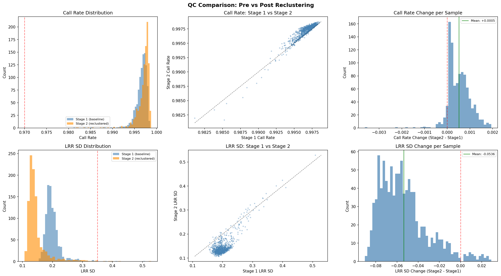
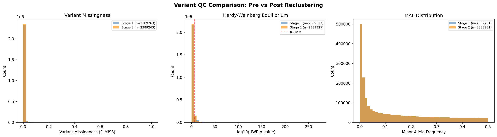

# Illumina IDAT Processing Pipeline

Process raw Illumina array IDAT data on HPC or command line **without Genome Studio**.

Inspired by [MoChA](https://github.com/freeseek/mocha) and [MoChA WDL](https://github.com/freeseek/mochawdl), this pipeline uses the open-source [bcftools](https://github.com/samtools/bcftools) plugins [idat2gtc](https://github.com/freeseek/gtc2vcf) and [gtc2vcf](https://github.com/freeseek/gtc2vcf) to convert raw Illumina intensity data directly to VCF format with BAF (B Allele Frequency) and LRR (Log R Ratio) intensities.

## Overview

The pipeline runs in eleven phases:

1. **Manifest Realignment**: Probe flank sequences from the CSV manifest are realigned against the reference genome using BWA, following the [MoChA/gtc2vcf](https://github.com/freeseek/gtc2vcf) best practice. This validates probe positions and enables correct coordinate mapping regardless of the original manifest build — **even if the CSV claims the same build as the reference**, this step catches discrepancies and ensures probes are placed correctly. A detailed mapping summary is output showing mapped, unmapped, multi-mapped, and coordinate-changed probes.

2. **Stage 1 — Initial Genotyping**: Convert IDAT files to GTC (genotype calls) using the Illumina GenCall algorithm (via `idat2gtc`), then to VCF format. Compute per-sample QC metrics including **call rate**, **LRR standard deviation**, **LRR mean**, **LRR median**, **BAF mean**, **BAF standard deviation** (contamination indicator), and **heterozygosity rate**. Per-variant QC (missingness, HWE, MAF, Ti/Tv, inbreeding F) is also computed.

3. **Stage 2 — Reclustering**: Identify high-quality samples from Stage 1 QC metrics (call rate ≥ 0.97, LRR SD ≤ 0.35 by default), recompute the EGT genotype cluster file from those samples' intensity data, then re-call genotypes for all samples using the new study-specific clusters. Cluster standard deviations are computed using the Bessel-corrected sample standard deviation (`ddof=1`) to provide unbiased estimates, matching Illumina GenTrain and field best practice. Probes where any genotype cluster has fewer than the minimum required samples (default 5) fall back to the original cluster definitions, producing a hybrid EGT that is study-specific where data permits and manufacturer-default elsewhere. The `--adjust-clusters` option is also applied during VCF conversion for additional BAF/LRR correction. A **QC comparison report and plots** are automatically generated comparing call rate, LRR SD, variant missingness, HWE, and MAF before and after reclustering. Can be skipped with `--skip-stage2`.

4. **Sex Check**: Both intensity-based and genotype-based sex determination methods are applied and cross-tabulated. **PAR1, PAR2, and XTR (X-transposed) regions are excluded** from all chrX-based analyses to avoid inflated male heterozygosity — these regions behave as autosomal loci and their inclusion biases the F-statistic toward 0 in males. Region definitions are centralized in `scripts/par_xtr_regions.py` and `scripts/utils.sh` per genome build (CHM13, GRCh38, GRCh37):
   - **LRR-based**: A scatter plot of median chrX vs chrY LRR per sample, colored by predicted sex. Males are expected to have lower chrX LRR (hemizygous) and higher chrY LRR. PAR/XTR sites on chrX are excluded so that the median reflects only non-pseudoautosomal loci.
   - **X-chromosome F-statistic**: Genotype-based inbreeding coefficient on chrX (non-PAR/XTR), computed via **plink2 `--check-sex`** when available. plink2 uses per-variant allele frequencies to compute expected heterozygosity, producing a more accurate F-statistic than simple het-rate proxies. If plink2 is not installed, a simplified bcftools-based approximation is used as a fallback. Males (hemizygous X) have F ≈ 1.0; females (diploid X) have F ≈ 0.0. Samples with 0.2 ≤ F ≤ 0.8 are flagged as ambiguous (potential aneuploidy or data issue). The raw plink2 `.sexcheck` output is exported for diagnostics. Both F-stat and LRR median results are cached for reuse when the pipeline re-invokes sex check after peddy.
   - **Peddy sex check** *(when peddy is enabled)*: After peddy runs, its genotype-based sex prediction is integrated into the cross-tabulation. chrX sites appended for peddy also exclude PAR/XTR regions.
   - All three methods are compared per sample. Discordances are flagged as `DISCORDANT`, ambiguous F-statistics as `AMBIGUOUS`, and full agreement as `CONCORDANT`. A summary report (`sex_check_summary.txt`) documents all findings and suggests potential causes (aneuploidy, sample swaps, contamination).

5. **Peddy QC** *(optional — skip with `--skip-peddy`)*: Run [peddy](https://github.com/brentp/peddy) for automated pedigree/sex/ancestry quality control. Peddy validates sex from genotypes, predicts ancestry by projecting onto 1000 Genomes principal components, and checks relatedness between all sample pairs. If a pedigree file (`--ped-file`) is provided it is validated; otherwise a minimal PED (unrelated singletons) is generated. A final pedigree incorporating peddy's discovered relationships is produced. Peddy's sample-level metrics (ancestry prediction, predicted sex, heterozygosity, PCs) are merged into the compiled sample sheet with a `peddy_` prefix. **Genome-aware**: when the pipeline genome is not GRCh38 (e.g. T2T-CHM13), `bcftools +liftover` is used to convert variant coordinates to GRCh38, variant IDs are set to `CHROM:POS:REF:ALT` to match peddy's GRCH38 sites list, and only matching sites are retained — producing a small, correctly-coordinated VCF for peddy regardless of the source reference build.

6. **Pre-PCA Sample Exclusions**: Prior to PCA and HWE testing, samples are filtered using two GWAS QC best-practice criteria (Anderson et al. 2010; Marees et al. 2018):
   - **Relatedness filtering**: Using peddy's `ped_check.csv` output, sample pairs with estimated relatedness ≥ 0.125 (second-degree relatives or closer) are identified. For each related pair, the sample with lower call rate (or higher LRR SD as tiebreaker) is selected for exclusion. Excluded sample IDs and the exclusion rationale are logged to `relatedness_exclusions.tsv`.
   - **Heterozygosity outlier removal**: Per-sample heterozygosity rates are computed within each peddy-predicted ancestry group. Samples whose heterozygosity rate falls more than 3 SD from their ancestry-group mean are flagged as outliers and excluded. This removes potential contaminated or inbred samples. Details are logged to `het_outlier_details.tsv`.
   - The combined exclusion list (`pre_pca_excluded_samples.txt`) is used by subsequent PCA and HWE steps. Excluded samples are still projected onto PCs (via flashpca2 `--project`) so they retain ancestry estimates.

7. **Ancestry-Stratified QC** *(runs before full-cohort PCA)*: Using peddy's ancestry predictions, the pipeline performs ancestry-stratified variant QC and PCA for each ancestry group meeting a minimum sample threshold (default: 100 samples, configurable via `--min-ancestry-samples`). Pre-PCA excluded samples (related and heterozygosity outliers) are removed from HWE testing and PCA training sets within each ancestry group. For each qualifying ancestry group (e.g., EUR, AFR, EAS):
   - The VCF is subset to samples of that ancestry
   - **Ancestry-specific variant QC** is computed on autosomes (missingness, HWE, MAF), avoiding inflated HWE deviation from the Wahlund effect in mixed-ancestry samples (Anderson et al. 2010)
   - **Sex chromosome variant QC** is computed separately with sex-aware handling (Anderson et al. 2010; Marees et al. 2018): chrX non-PAR HWE is tested on females only (males are hemizygous), missingness and frequency on all samples; chrY metrics are computed on males only. PAR/XTR regions are excluded. Requires `--sample-qc` with `computed_gender` column
   - **Within-ancestry PCA** resolves finer population structure masked by multi-ancestry PCA (Peterson et al. 2019)
   - All variant QC metrics — autosomal, per-ancestry, and sex chromosome — are collated into a single `collated_variant_qc.tsv` file with columns like `EUR_call_rate`, `EUR_hwe_p`, `EUR_maf`, `chrX_call_rate`, `chrX_hwe_p_females`, `chrX_maf`, `chrY_call_rate`, `chrY_maf` alongside the full-cohort equivalents; cross-ancestry summary flags (`all_ancestries_call_rate_pass`, `all_ancestries_hwe_pass`, `all_ancestries_maf_pass`, `all_ancestries_qc_pass`) indicate whether each variant passes each metric (and all metrics combined) across every ancestry subset analyzed. If a Ti/Tv statistics file is available, the project-level Ti/Tv ratio is included as a `#tstv_ratio=` header comment
   - A **HWE-passing variant list** (`hwe_passing_variants.txt`) is produced: the intersection of variants passing HWE (p ≥ 1e-6) across all ancestry groups. This list is used by the subsequent full-cohort PCA step (Price et al. 2006; Anderson et al. 2010)
   - Ancestry-specific PCs are included in the compiled sample sheet, with `NaN` for samples not of a given ancestry

8. **Ancestry PCA** *(uses HWE-passing variants from ancestry-stratified QC)*: Perform stringent best-practice variant and sample QC filtering (using plink2), LD pruning, and compute ancestry principal components using [flashpca2](https://github.com/gabraham/flashpca) on the QC'd set of variants and unrelated, non-outlier samples. When ancestry-stratified QC is available, PCA is restricted to variants that pass HWE in all ancestry groups (`--include-variants hwe_passing_variants.txt`), avoiding the chicken-and-egg problem of filtering on HWE in mixed-ancestry groups. PCs are then projected to all samples (including those excluded for relatedness or heterozygosity outlier status). By default, 20 PCs are computed. The `--exclude-samples` option can be used to provide a custom exclusion list.

9. **Compiled Sample Sheet**: A unified sample sheet is produced combining all QC metrics (call rate, LRR SD, LRR mean, LRR median, BAF mean, BAF SD, heterozygosity rate, predicted sex, inbreeding F), sex check cross-tabulation (`chrx_lrr_median`, `chry_lrr_median`, `peddy_sex`, `sex_status`), pre-PCA exclusion flags (`excluded_relatedness`, `excluded_het_outlier`, `pre_pca_excluded`), ancestry PCs (default 20), ancestry-specific PCs (e.g., `EUR_PC1`, `AFR_PC1`, with `NaN` for non-members), and peddy sample-level metrics (ancestry prediction, sex check, heterozygosity) for every sample.

10. **QC Diagnostics & Report**: Automated QC diagnostics (`scripts/diagnose_qc.py`) identify potential issues (deflated call rates, inflated LRR SD, build mismatches) using intentionally wider diagnostic thresholds (call rate ≥ 0.95, LRR SD ≤ 0.40) than the standard GWAS QC thresholds to surface warnings early. The diagnostic report can also be run standalone: `python3 scripts/diagnose_qc.py --output-dir /path/to/output`. A comprehensive **interactive HTML pipeline report** is generated featuring:
   - **Interactive Plotly.js charts** — Call Rate vs LRR SD scatter plot and metric distribution histograms with hover tooltips, zoom, and pan
   - **GWAS QC best-practice thresholds** — Reference table citing Anderson et al. (2010), Marees et al. (2018), and Turner et al. (2011), covering sample call rate (≥ 0.97), LRR SD (≤ 0.35), BAF SD (≤ 0.15), heterozygosity rate (± 3 SD), variant missingness (< 0.02), HWE p-value (≥ 1e-6), MAF (≥ 0.01), and inbreeding F (|F| ≤ 0.05), with per-threshold rationale and citation notes in the report
   - **Tabbed ancestry-stratified variant QC** — Switch between "All" (full cohort) and per-ancestry variant QC summaries and interactive plots (call rate, MAF, HWE distribution histograms) for each ancestry group, with a cross-ancestry pass summary card reporting how many variants pass each QC metric across all analyzed ancestries. Histogram data is pre-binned server-side (call rate and MAF at 1% bins, HWE −log₁₀p at 0.1 bins) so the HTML report stays compact regardless of variant count
   - **Compiled methods citations summary** — Exported as `citations_summary.tsv` and rendered in the report, listing each citation, what it supports, and how that method/tool/algorithm is applied in this pipeline
   - **Per-sample QC table** — Searchable, sortable table with color-coded pass/fail/warning indicators for every sample
   - **Visual overview** — KPI metric cards, QC pass-rate progress bar, stage comparison with color-coded improvement indicators
   - Publication-quality static figures (QC dashboard, PCA scatter, sex check) and auto-generated methods paragraph

11. **Summary Bundle**: All key outputs — including pre-PCA exclusion lists (`pre_pca_excluded_samples.txt`, `relatedness_exclusions.tsv`, `het_outlier_details.tsv`) — are consolidated into a `summary/` directory for easy retrieval.

### Reference Genome

The pipeline defaults to the **T2T-CHM13v2.0** reference genome — the first complete, telomere-to-telomere assembly of a human genome. CHM13 resolves gaps and errors present in GRCh38, providing improved probe mapping for Illumina arrays. GRCh38 and GRCh37 remain supported via `--genome GRCh38` or `--genome GRCh37`.

#### PAR/XTR Region Handling

Pseudoautosomal regions (PAR1, PAR2) and the X-transposed region (XTR) on chrX and chrY are automatically excluded from all sex-determination analyses. These regions are homologous between chrX and chrY (PAR) or have high X-Y sequence identity (XTR), causing males to appear diploid at these loci. Including them inflates observed heterozygosity in males on chrX (biasing the F-statistic toward 0) and biases the chrY LRR median by including diploid-behaving loci.

Region boundaries per genome build are defined in `scripts/par_xtr_regions.py` (Python) and `scripts/utils.sh` (Bash):

| Build | Region | Chrom | Start | End |
|-------|--------|-------|-------|-----|
| CHM13 | PAR1 | chrX | 0 | 2,781,479 |
| CHM13 | XTR | chrX | 2,781,479 | 6,400,875 |
| CHM13 | PAR2 | chrX | 155,701,382 | 156,040,895 |
| CHM13 | PAR1 | chrY | 0 | 2,458,320 |
| CHM13 | XTR | chrY | 2,458,320 | 6,400,875 |
| CHM13 | PAR2 | chrY | 62,122,809 | 62,460,029 |
| GRCh38 | PAR1 | chrX | 10,001 | 2,781,479 |
| GRCh38 | XTR | chrX | 2,781,479 | 6,400,000 |
| GRCh38 | PAR2 | chrX | 155,701,383 | 156,030,895 |
| GRCh38 | PAR1 | chrY | 10,001 | 2,781,479 |
| GRCh38 | PAR2 | chrY | 56,887,903 | 57,217,415 |
| GRCh37 | PAR1 | X | 60,001 | 2,699,520 |
| GRCh37 | XTR | X | 2,699,520 | 6,100,000 |
| GRCh37 | PAR2 | X | 154,931,044 | 155,260,560 |
| GRCh37 | PAR1 | Y | 10,001 | 2,649,520 |
| GRCh37 | PAR2 | Y | 59,034,050 | 59,363,566 |

XTR on chrY is well-defined for CHM13 (from [GIAB genome-stratifications v3.1](https://github.com/genome-in-a-bottle/genome-stratifications)) but not clearly delineated in the reference assemblies for GRCh38/GRCh37 — only PAR1/PAR2 regions are excluded on chrY for those builds.

To add support for a new genome build, add an entry to `_PAR_XTR_REGIONS` in `scripts/par_xtr_regions.py` and a new `case` clause in `get_par_xtr_bed()` in `scripts/utils.sh`. See [CHM13-annotations](https://github.com/marbl/CHM13-annotations) and [GIAB genome stratifications](https://github.com/genome-in-a-bottle/genome-stratifications) for updated boundaries.

The output VCF (with `GT`, `BAF`, and `LRR` FORMAT fields) is ready for downstream analysis such as phasing with [SHAPEIT5](https://odelaneau.github.io/shapeit5/), mosaic chromosomal alteration detection with [MoChA](https://github.com/freeseek/mocha), or imputation with [IMPUTE5](https://jmarchini.org/software/#impute-5).

## Quick Start

### Apptainer (recommended for HPC)

A pre-built container image is available from GitHub Container Registry.
Run the pipeline directly via Apptainer — no local installation required:

```bash
# Pull the image (optional — Apptainer can also pull on-demand)
apptainer pull docker://ghcr.io/jlanej/illumina_idat_processing:main

# Run the full pipeline (auto-downloads manifests and reference for known arrays)
apptainer exec --bind /path/to/data:/data illumina_idat_processing_main.sif \
    bash /opt/scripts/run_pipeline.sh \
    --idat-dir /data/idats \
    --array-name GSA-24v3-0_A1 \
    --output-dir /data/output

# With pre-downloaded manifests and reference
apptainer exec --bind /path/to/data:/data illumina_idat_processing_main.sif \
    bash /opt/scripts/run_pipeline.sh \
    --idat-dir /data/idats \
    --bpm /data/manifests/array.bpm \
    --egt /data/manifests/array.egt \
    --csv /data/manifests/array.csv \
    --ref-fasta /data/reference/chm13v2.0.fa \
    --output-dir /data/output
```

### 1000 Genomes Example

Process 1000 Genomes Omni2.5 IDAT data (downloads automatically):

```bash
# Process all ~2141 samples on HPC with Apptainer
apptainer exec --bind $PWD illumina_idat_processing_main.sif \
    bash /opt/scripts/process_1000g.sh \
    --output-dir $PWD/1000g_output --num-samples all --threads 8

# Reuse a pre-downloaded archive (skips archive download)
apptainer exec --bind $PWD illumina_idat_processing_main.sif \
    bash /opt/scripts/process_1000g.sh \
    --output-dir $PWD/1000g_output \
    --archive $PWD/Omni25_idats_gtcs_2141_samples.tgz \
    --num-samples all --threads 8

# Reuse a pre-extracted IDAT directory (skips archive download/extraction)
apptainer exec --bind $PWD illumina_idat_processing_main.sif \
    bash /opt/scripts/process_1000g.sh \
    --output-dir $PWD/1000g_output \
    --idat-dir /data/1000g_idats \
    --num-samples all --threads 8
```

The `--archive` file is treated as user-managed input and is never deleted by `process_1000g.sh`.
When `--idat-dir` is provided, `process_1000g.sh` reuses that directory directly.

> **Other run methods** (Docker, from source): see [docs/alternative_run_methods.md](docs/alternative_run_methods.md).

## Requirements

- Linux (tested on Ubuntu/Debian, should work on any HPC)
- [Apptainer](https://apptainer.org/) (formerly Singularity) for running the container
- ~30 GB disk for CHM13 reference genome (auto-downloaded on first run)

### Pinned Dependencies (Docker image)

All external tools in the Docker image are pinned to specific versions for full reproducibility:

| Tool | Version / Commit | Purpose |
|------|-----------------|---------|
| bcftools | 1.23 | VCF processing and plugins |
| gtc2vcf plugins | [`cc48989`](https://github.com/freeseek/gtc2vcf/commit/cc4898976c11dda6c7bfb3473d13afea11c48a1c) (2026-02-26) | IDAT/GTC/VCF conversion |
| mocha plugins | [`95686b7`](https://github.com/freeseek/mocha/commit/95686b7b65f53a490513be76bb120e5fc20a8bcf) (2025-08-22) | Mosaic chromosomal alteration detection |
| liftover plugin | [`909d230`](https://github.com/freeseek/score/commit/909d23019e19aeadf3bf6fe1407fd6afc094592a) (2026-02-02) | Coordinate liftover between genome builds |
| plink2 | [v2.0.0-a.6.33](https://github.com/chrchang/plink-ng/releases/tag/v2.0.0-a.6.33) | Variant-level QC |
| flashpca2 | [`b8044f1`](https://github.com/gabraham/flashpca/commit/b8044f13607a072125828547684fde8b081d6191) | Fast PCA computation |
| NumPy | < 1.25 | Numerical computation |
| peddy | latest | Pedigree/sex/ancestry QC |

## Usage

### Full Pipeline (via Apptainer)

```bash
apptainer exec --bind $PWD illumina_idat_processing_main.sif \
    bash /opt/scripts/run_pipeline.sh [OPTIONS]
```

**Required:**
| Option | Description |
|--------|-------------|
| `--idat-dir DIR` | Directory containing IDAT files |
| `--output-dir DIR` | Output directory |

**Manifest options (one of):**
| Option | Description |
|--------|-------------|
| `--array-name NAME` | Known array name (auto-downloads manifests) |
| `--manifest-dir DIR` | Directory containing BPM, EGT, and CSV files |
| `--bpm FILE` / `--egt FILE` / `--csv FILE` | Individual manifest files |

**Reference options:**
| Option | Description |
|--------|-------------|
| `--ref-fasta FILE` | Reference FASTA (overrides auto-download) |
| `--ref-dir DIR` | Directory with reference genome |
| `--genome NAME` | Genome build: `CHM13`, `GRCh37`, or `GRCh38` (default: `CHM13`) |

**Processing options:**
| Option | Description |
|--------|-------------|
| `--threads INT` | Number of threads (default: 1) |
| `--min-call-rate FLOAT` | Min call rate for HQ samples in Stage 2 (default: 0.97) |
| `--max-lrr-sd FLOAT` | Max LRR SD for HQ samples in Stage 2 (default: 0.35) |
| `--min-ancestry-samples INT` | Minimum samples per ancestry group for ancestry-stratified QC (default: 100) |
| `--sample-name-map FILE` | Two-column tab-delimited file mapping IDAT root names to desired sample names |
| `--ped-file FILE` | Pedigree file (.ped/.fam) for peddy relationship validation. If not provided, a minimal PED (unrelated singletons) is generated |
| `--force-rename` | Allow renaming even when fewer than 50% of samples match the name map |
| `--skip-stage2` | Skip Stage 2 reclustering |
| `--skip-peddy` | Skip peddy pedigree/sex/ancestry QC step (also skips ancestry-stratified QC) |
| `--skip-download` | Do not auto-download manifests or reference |
| `--skip-failures` | Continue past corrupt/truncated IDAT files instead of halting |
| `--force` | Force re-run of all steps, ignoring checkpoints |

### Individual Scripts

Each stage can also be run independently via Apptainer:

```bash
SIF=illumina_idat_processing_main.sif

# Download manifests for a known array
apptainer exec --bind $PWD $SIF \
    bash /opt/scripts/download_manifests.sh --array-name GSA-24v3-0_A1 --output-dir manifests/

# Download reference genome (CHM13 by default)
apptainer exec --bind $PWD $SIF \
    bash /opt/scripts/download_reference.sh --output-dir reference/

# Stage 1: Initial genotyping
apptainer exec --bind $PWD $SIF \
    bash /opt/scripts/stage1_initial_genotyping.sh \
    --idat-dir /path/to/idats \
    --bpm manifests/GSA-24v3-0_A1.bpm \
    --egt manifests/GSA-24v3-0_A1_ClusterFile.egt \
    --csv manifests/GSA-24v3-0_A1.csv \
    --ref-fasta reference/chm13v2.0.fa \
    --output-dir output/stage1

# Stage 2: Recluster and reprocess
apptainer exec --bind $PWD $SIF \
    bash /opt/scripts/stage2_recluster.sh \
    --idat-dir /path/to/idats \
    --bpm manifests/GSA-24v3-0_A1.bpm \
    --egt manifests/GSA-24v3-0_A1_ClusterFile.egt \
    --csv manifests/GSA-24v3-0_A1.csv \
    --ref-fasta reference/chm13v2.0.fa \
    --stage1-dir output/stage1 \
    --output-dir output/stage2
```

### WDL Workflow

A [WDL](https://openwdl.org/) workflow is provided at `wdl/illumina_idat_processing.wdl` for use with [Cromwell](https://cromwell.readthedocs.io/) on HPC or cloud.
The WDL calls `run_pipeline.sh` inside the pre-built container image, keeping the workflow simple and always in sync with the pipeline.

**Quickstart** — download Cromwell and generate a template inputs file in one step:

```bash
bash wdl/quickstart.sh --output-dir ./cromwell_run
```

Then fill in `cromwell_run/inputs_template.json` with your data paths and run:

```bash
java -Dconfig.file=cromwell_run/cromwell_apptainer.conf \
    -jar cromwell_run/cromwell-87.jar run \
    wdl/illumina_idat_processing.wdl \
    --inputs cromwell_run/inputs.json
```

Example inputs JSON:

```json
{
  "illumina_idat_processing.idat_files": [
    "/data/sample1_Grn.idat", "/data/sample1_Red.idat",
    "/data/sample2_Grn.idat", "/data/sample2_Red.idat"
  ],
  "illumina_idat_processing.bpm_file":      "/data/manifests/array.bpm",
  "illumina_idat_processing.egt_file":      "/data/manifests/array.egt",
  "illumina_idat_processing.csv_file":      "/data/manifests/array.csv",
  "illumina_idat_processing.ref_fasta":     "/data/reference/chm13v2.0.fa",
  "illumina_idat_processing.ref_fasta_fai": "/data/reference/chm13v2.0.fa.fai"
}
```

## Supported Arrays

The following arrays have pre-configured manifest download URLs in `config/manifest_urls.tsv`:

| Array | Description |
|-------|-------------|
| `GSA-24v3-0_A1` | Global Screening Array v3.0 (GRCh37) |
| `GSA-24v3-0_A2` | Global Screening Array v3.0 (GRCh38) |
| `GSA-24v2-0_A1` | Global Screening Array v2.0 (GRCh37) |
| `GSA-24v1-0_A1` | Global Screening Array v1.0 (GRCh37) |
| `MEGA_Consortium_v2-0_A1` | Multi-Ethnic Global Array v2.0 |
| `InfiniumOmni2-5-8v1-5_A1` | Infinium Omni2.5 v1.5 |
| `HumanCNV370v1_C` | HumanCNV370-Duo v1.0 |
| `HumanOmni2-5-4v1-Multi_B` | HumanOmni2.5-4 v1 Multi (1000G) |

Additional arrays can be processed by providing manifest files directly with `--bpm`, `--egt`, and `--csv`, or by adding entries to `config/manifest_urls.tsv`.

## Output Files

```
output/
├── stage1/
│   ├── gtc/                    # GTC genotype files (original clusters)
│   ├── vcf/
│   │   └── stage1_initial.bcf  # Initial VCF with BAF + LRR
│   └── qc/
│       ├── stage1_sample_qc.tsv  # Per-sample call rate, LRR SD/mean/median
│       ├── gtc_metadata.tsv      # GTC file metadata
│       ├── failed_idat2gtc.tsv   # Failed samples (if --skip-failures used)
│       └── variant_qc/           # Variant-level QC metrics
│           ├── variant_qc.vmiss  # Per-variant missingness
│           ├── variant_qc.hardy  # Hardy-Weinberg equilibrium tests
│           ├── variant_qc.afreq  # Allele frequency statistics
│           └── variant_qc.het    # Per-sample inbreeding coefficients
├── stage2/
│   ├── gtc/                    # Re-called GTC files (new clusters)
│   ├── vcf/
│   │   └── stage2_reclustered.bcf  # Reclustered VCF (final output)
│   ├── qc/
│   │   ├── stage2_sample_qc.tsv    # Updated QC metrics
│   │   ├── high_quality_samples.txt # Samples used for reclustering
│   │   ├── excluded_samples.txt     # Low-quality samples
│   │   ├── variant_qc/             # Variant-level QC metrics (post-recluster)
│   │   └── comparison/              # Pre/post reclustering QC comparison
│   │       ├── qc_comparison_report.txt  # Summary statistics text report
│   │       ├── qc_comparison_samples.png # Sample-level QC comparison plots
│   │       └── qc_comparison_variants.png # Variant-level QC comparison plots
│   └── clusters/
│       └── reclustered.egt          # Study-specific EGT cluster file
├── sex_check/
│   ├── sex_check_chrXY_lrr.png     # Median chrX vs chrY LRR by predicted sex
│   └── sex_check_chrXY_lrr.tsv     # Per-sample median chrX/chrY LRR values used in report
├── peddy/                           # Peddy pedigree/sex/ancestry QC
│   ├── peddy.het_check.csv          # Ancestry prediction, het ratio, PCs per sample
│   ├── peddy.sex_check.csv          # Sex check: predicted vs PED sex per sample
│   ├── peddy.ped_check.csv          # Pairwise relatedness checks
│   ├── peddy.peddy.ped              # Enhanced PED with QC flags
│   ├── peddy_final.ped              # Final pedigree with discovered relationships
│   ├── peddy.html                   # Peddy interactive report
│   └── peddy.background_pca.json    # Ancestry PCA projection data
├── ancestry_pca/
│   ├── pca_projections.tsv          # All-sample PC projections (20 PCs)
│   ├── pca_eigenvalues.txt          # PCA eigenvalues
│   ├── pca_qc_samples.txt           # QC'd sample set used for PCA
│   └── qc_summary.txt               # QC filtering summary
├── ancestry_stratified_qc/          # Ancestry-stratified QC (if peddy ran)
│   ├── ancestry_assignments.tsv     # Sample-to-ancestry mapping from peddy
│   ├── collated_variant_qc.tsv      # Unified variant QC across all ancestries
│   │                                 # (autosomal + chrX/chrY, genotype counts,
│   │                                 #  missingness, HWE stats, and Ti/Tv ratio)
│   ├── ancestry_stratified_summary.txt # Summary of stratified analyses
│   ├── sex_chr_qc/                  # Sex chromosome variant QC
│   │   ├── chrx_variant_qc.vmiss   # chrX non-PAR missingness (all samples)
│   │   ├── chrx_variant_qc.hardy   # chrX non-PAR HWE (females only)
│   │   ├── chrx_variant_qc.afreq   # chrX non-PAR allele frequencies
│   │   ├── chry_variant_qc.vmiss   # chrY missingness (males only)
│   │   ├── chry_variant_qc.afreq   # chrY allele frequencies (males only)
│   │   └── sex_chr_variant_qc_summary.txt
│   ├── EUR/                         # Per-ancestry analysis (example: EUR)
│   │   ├── samples.txt              # Sample list for this ancestry
│   │   ├── EUR_subset.bcf           # VCF subset to EUR samples
│   │   ├── variant_qc/             # Ancestry-specific variant QC
│   │   │   ├── variant_qc.vmiss    # EUR-specific missingness
│   │   │   ├── variant_qc.hardy    # EUR-specific HWE
│   │   │   └── variant_qc.afreq    # EUR-specific allele frequencies
│   │   └── pca/                     # Within-ancestry PCA
│   │       ├── pca_projections.tsv  # EUR PCs for EUR samples
│   │       └── qc_summary.txt      # EUR PCA QC summary
│   └── AFR/                         # (repeat for each qualifying ancestry)
├── compiled_sample_sheet.tsv        # Unified sample sheet (QC + sex check +
│                                     # exclusion flags + PCs + ancestry PCs + peddy)
├── qc_diagnostic_report.txt         # Automated QC diagnostic report
├── pipeline_report.html             # Comprehensive HTML report with figures
├── summary_statistics.tsv           # Publication-ready summary statistics table
├── methods_text.txt                 # Auto-generated methods paragraph
├── qc_dashboard.png                 # Sample QC dashboard figure
├── pca_scatter.png                  # PCA scatter plots (PC1 vs PC2, PC3 vs PC4)
├── manifests/                  # Downloaded manifest files (if auto-downloaded)
├── realigned_manifests/        # Realigned manifest and mapping summary
│   ├── *.realigned.csv         # CSV with validated/remapped coordinates
│   └── realign_summary.txt     # Detailed mapping statistics
└── reference/                  # Downloaded reference (if auto-downloaded)
```

### QC Metrics File Format

The `*_sample_qc.tsv` files contain per-sample metrics:

| Column | Description |
|--------|-------------|
| `sample_id` | Sample identifier |
| `call_rate` | Fraction of variants with non-missing genotype calls (autosomes only) |
| `lrr_sd` | Standard deviation of Log R Ratio (autosomes only; lower is better) |
| `lrr_mean` | Mean of Log R Ratio (autosomes only) |
| `lrr_median` | Median of Log R Ratio (autosomes only) |
| `baf_mean` | Mean of B Allele Frequency at heterozygous sites |
| `baf_sd` | Standard deviation of B Allele Frequency at heterozygous sites (contamination/mosaicism indicator) |
| `het_rate` | Fraction of heterozygous genotype calls (autosomes only) |
| `computed_gender` | Inferred gender (1=male, 2=female) |

The `comparison/` subdirectory (Stage 2 only) contains:

| File | Description |
|------|-------------|
| `qc_comparison_report.txt` | Text summary of all QC metric changes pre/post reclustering |
| `qc_comparison_samples.png` | Plots of per-sample call rate and LRR SD distributions before/after |
| `qc_comparison_variants.png` | Plots of variant missingness, HWE, and MAF distributions before/after |

### Compiled Sample Sheet Columns

The `compiled_sample_sheet.tsv` merges all per-sample QC metrics into a single table. The columns are:

| Column(s) | Source | Description |
|-----------|--------|-------------|
| `sample_id`, `call_rate`, `lrr_sd`, `lrr_mean`, `lrr_median`, `baf_mean`, `baf_sd`, `het_rate`, `computed_gender` | `*_sample_qc.tsv` | Core QC metrics from collect_qc_metrics.sh |
| `inbreeding_F` | plink2 `.het` file | Inbreeding coefficient (if variant QC .het available) |
| `chrx_lrr_median`, `chry_lrr_median`, `peddy_sex`, `sex_status` | `sex_check_chrXY_lrr.tsv` | Sex check cross-tabulation (LRR-based, peddy, concordance) |
| `excluded_relatedness`, `excluded_het_outlier`, `pre_pca_excluded` | Exclusion lists | Pre-PCA exclusion flags (1=excluded, 0=not excluded) |
| `PC1`–`PC20` | `pca_projections.tsv` | Full-cohort ancestry PCA projections |
| `EUR_PC1`–`EUR_PC20`, `AFR_PC1`–… | Ancestry-specific PCA | Within-ancestry PCs (NaN for non-members) |
| `peddy_het_ratio`, `peddy_mean_depth`, `peddy_ancestry-prediction`, `peddy_ancestry-prob`, `peddy_PC1`–`peddy_PC4` | peddy `het_check.csv` | Peddy heterozygosity and ancestry metrics |
| `peddy_sex_predicted_sex`, `peddy_sex_het_ratio`, `peddy_sex_error` | peddy `sex_check.csv` | Peddy sex prediction metrics |

### Collated Variant QC Columns

The `collated_variant_qc.tsv` merges per-variant QC across the full cohort and each ancestry. Columns follow the pattern `{scope}_{metric}` where scope is `all` (full cohort) or an ancestry code (e.g. `EUR`, `AFR`):

| Column pattern | Source | Description |
|----------------|--------|-------------|
| `variant_id` | — | Variant identifier |
| `{scope}_call_rate` | `.vmiss` (1 − F_MISS) | Genotype call rate |
| `{scope}_hwe_p` | `.hardy` P column | Hardy-Weinberg equilibrium p-value |
| `{scope}_maf` | `.afreq` ALT_FREQS | Minor allele frequency |
| `{scope}_obs_ct` | `.vmiss` OBS_CT | Observed genotype count |
| `{scope}_missing_ct` | `.vmiss` MISSING_CT | Missing genotype count |
| `{scope}_hom_a1_ct` | `.hardy` HOM_A1_CT | Homozygous reference count |
| `{scope}_het_ct` | `.hardy` HET_A1_AX_CT | Heterozygous count |
| `{scope}_hom_a2_ct` | `.hardy` TWO_AX_CT | Homozygous alternate count |
| `all_ancestries_call_rate_pass` | computed | 1 if call rate ≥ 0.98 in all ancestries |
| `all_ancestries_hwe_pass` | computed | 1 if HWE p ≥ 1e-6 in all ancestries |
| `all_ancestries_maf_pass` | computed | 1 if MAF ≥ 0.01 in all ancestries |
| `all_ancestries_qc_pass` | computed | 1 if all three metrics pass in all ancestries |
| `#tstv_ratio=` (header comment) | `tstv_stats.txt` | Project-level Ti/Tv ratio (if available) |

## Processing Rationale

### Manifest Realignment

Before genotyping, the pipeline always realigns probe flank sequences from the CSV manifest against the reference genome using BWA (`scripts/realign_manifest.sh`). This follows the [MoChA WDL](https://github.com/freeseek/mochawdl) best practice and is critical for two reasons:

1. **Cross-build remapping**: If the manifest was designed for GRCh37 but processing targets GRCh38 (or vice versa), `gtc2vcf` does **not** automatically remap coordinates. The flank alignment produces a remapped CSV with correct positions for the target reference.

2. **Position validation**: Even when the manifest claims the same build, probes can have incorrect positions due to assembly updates, manufacturer errors, or custom array designs. Realignment validates every probe against the actual reference sequence.

The pipeline outputs a detailed mapping summary (`realign_summary.txt`) reporting:
- Total probes, mapped/unmapped counts, mapping quality distribution
- Coordinate changes: positions confirmed, changed, newly placed, or lost

**Error handling**: The realignment step aborts the pipeline with a clear error if any of the following conditions occur:
- Flank sequence extraction fails or produces zero sequences (malformed or missing `[Assay]`/`SourceSeq` in the CSV)
- BWA alignment fails
- Realigned CSV is not created, is empty, or lacks an `[Assay]` section
- Realigned CSV contains fewer than 3 data lines (indicating a failed realignment)

### Two-Stage Genotyping

Standard Illumina genotyping uses pre-built cluster files (EGT) derived from a training set. However, batch effects, population differences, and varying sample quality can degrade genotype calls when the default clusters don't match the study population.

**Stage 1** applies the default EGT clusters to produce initial genotype calls and computes per-sample QC metrics. Samples with low call rate (< 0.97) or high LRR standard deviation (> 0.35) are flagged as low quality. Samples with missing LRR SD values (e.g. too few variants for computation) are also excluded from the high-quality set.

**Stage 2** performs true reclustering in four steps:

1. **Recompute EGT**: Using `scripts/recluster_egt.py`, extracts normalized intensity data (theta, R coordinates) from Stage 1 GTC files of high-quality samples, grouped by their genotype calls (AA/AB/BB). For each probe, recomputes the cluster means and standard deviations in (theta, R) space using a streaming algorithm (Welford's online method) that requires only O(probes) memory regardless of sample count. float64 accumulators ensure numerical stability. Probes with insufficient data fall back to the original cluster definitions. The result is a new EGT file tailored to the study population.

2. **Re-call genotypes**: Runs `idat2gtc` with the new EGT file, producing improved genotype calls for ALL samples. Because the GenCall algorithm uses the EGT cluster definitions to assign each sample's intensities to the correct genotype, study-specific clusters yield more accurate genotype calls than the default Illumina training set.

3. **Convert to VCF**: Runs `gtc2vcf` with `--adjust-clusters` for additional median adjustment of BAF and LRR values.

4. **QC comparison**: Automatically generates a before/after comparison report and plots (saved to `stage2/qc/comparison/`) quantifying the improvement in call rate, LRR SD, variant missingness, HWE conformance, and MAF distributions.

This approach is fundamentally different from just using `--adjust-clusters` in `gtc2vcf` (which only adjusts BAF/LRR post-hoc without changing the underlying genotype calls). By recomputing the actual EGT cluster definitions, we improve the genotype calls themselves — analogous to the iterative clustering performed in Genome Studio, but fully automated for HPC.

See **[docs/qc_comparison.md](docs/qc_comparison.md)** for a detailed explanation of the QC comparison outputs and how to interpret them.

### QC Thresholds and Scientific Rationale

The pipeline report surfaces default QC thresholds that are commonly used in GWAS QC workflows and inherited from `scripts/generate_report.py` and `scripts/ancestry_pca.sh`.

| Metric | Default threshold | Where used | Evidence basis |
|--------|-------------------|------------|----------------|
| Sample call rate | `>= 0.97` | Stage 1/2 sample QC pass/fail | Anderson 2010; Marees 2018 |
| LRR SD | `<= 0.35` | Stage 1/2 sample QC pass/fail | Turner 2011; array intensity QC practice |
| BAF SD (het sites) | `<= 0.15` (flag) | Sample-level contamination/noise flag | Turner 2011; Marees 2018 |
| Heterozygosity rate | within `±3 SD` | Sample outlier flagging | Anderson 2010; Marees 2018 |
| Variant missingness | `< 0.02` | Variant QC summaries / filtering guidance | Anderson 2010; Turner 2011 |
| HWE p-value | `>= 1e-6` | Variant QC summaries / filtering guidance | Anderson 2010; Marees 2018 |
| Variant MAF | `>= 0.01` | Variant QC summaries / filtering guidance | Marees 2018 |
| PCA MAF | `>= 0.05` | `ancestry_pca.sh` default projection set | Common ancestry PCA stabilization practice |
| Inbreeding F | `|F| <= 0.05` (flag) | Sample outlier flagging | Turner 2011 |

These are robust defaults, but they are not one-size-fits-all. For very small cohorts, founder populations, case-only designs, or rare-variant-focused studies, thresholds should be reviewed with domain context and adjusted using pipeline options where appropriate.

> **Diagnostic vs. GWAS thresholds**: The automated QC diagnostics tool (`diagnose_qc.py`) uses intentionally wider thresholds (call rate ≥ 0.95, LRR SD ≤ 0.40) to flag potential systematic issues such as build mismatches or normalization errors. These are separate from the stricter GWAS QC thresholds above, which are used for sample pass/fail classification in the pipeline report and for Stage 2 sample filtering.

### Pre/Post Reclustering QC Comparison

After Stage 2 completes, a QC comparison report and diagnostic plots are automatically generated in `stage2/qc/comparison/`. These quantify the improvement from reclustering across all samples and variants.

**Example results on 1000 Genomes data (1,000 samples, HumanOmni2.5 array):**

**Sample-level QC:**

| Metric | Stage 1 (baseline) | Stage 2 (reclustered) | Change |
|--------|-------------------|----------------------|--------|
| Mean call rate | 0.9965 | 0.9971 | +0.0005 |
| Median call rate | 0.9968 | 0.9975 | +0.0005 |
| Mean LRR SD | 0.1997 | 0.1461 | **−0.0536** |
| Median LRR SD | 0.1946 | 0.1355 | **−0.0573** |
| Samples improved (call rate) | — | — | 938/1000 (93.8%) |
| Samples improved (LRR SD) | — | — | 967/1000 (96.7%) |
| Samples passing LRR SD ≤ 0.20 | 631 | **935** | **+304** |

**Variant-level QC:**

| Metric | Stage 1 | Stage 2 | Change |
|--------|---------|---------|--------|
| Variants with missingness ≤ 1% | 2,284,343 | 2,302,478 | +18,135 |
| Variants with missingness ≤ 2% | 2,342,084 | 2,355,303 | +13,219 |
| Variants passing HWE p ≥ 1e-6 | 2,204,543 | 2,205,649 | +1,106 |
| Variants with MAF ≥ 1% | 1,889,522 | 1,890,989 | +1,467 |

The most striking improvement is in **LRR SD** — the key metric for CNV/mosaic detection quality — where reclustering reduces the median from 0.1946 to 0.1355, and increases the fraction of samples passing the strict LRR SD ≤ 0.20 threshold from 63% to 94%.

**Sample QC comparison plots (1000G, 1000 samples):**



**Variant QC comparison plots:**



## Downstream Analysis

After running this pipeline, the output VCF can be used directly with:

- **[MoChA](https://github.com/freeseek/mocha)** — Detection of mosaic chromosomal alterations
- **[SHAPEIT5](https://odelaneau.github.io/shapeit5/)** — Genotype phasing
- **[IMPUTE5](https://jmarchini.org/software/)** / **[Beagle5](https://faculty.washington.edu/browning/beagle/)** — Genotype imputation
- **[PLINK2](https://www.cog-genomics.org/plink/2.0/)** — GWAS and population genetics
- **[flashpca2](https://github.com/gabraham/flashpca)** — Fast ancestry PCA computation (used in ancestry PCA step)

### Copy Number Variation (CNV) Calling

The pipeline's BAF and LRR output is directly suitable for CNV detection. See **[docs/cnv_calling_methods.md](docs/cnv_calling_methods.md)** for a detailed survey of compatible methods, including PennCNV, bcftools +mocha (already installed), QuantiSNP, and EnsembleCNV.

## References

- Anderson C.A. et al. *Data quality control in genetic case-control association studies.* Nat Protoc 5, 1564–1573 (2010). [DOI: 10.1038/nprot.2010.116](https://doi.org/10.1038/nprot.2010.116)
- Marees A.T. et al. *A tutorial on conducting genome-wide association studies: Quality control and statistical analysis.* Int J Methods Psychiatr Res 27:e1608 (2018). [DOI: 10.1002/mpr.1608](https://doi.org/10.1002/mpr.1608)
- Turner S. et al. *Quality Control Procedures for Genome-Wide Association Studies.* Curr Protoc Hum Genet, Unit 1.19 (2011). [DOI: 10.1002/0471142905.hg0119s68](https://doi.org/10.1002/0471142905.hg0119s68)
- Loh P., Genovese G., McCarroll S., Price A. et al. *Insights about clonal expansions from 8,342 mosaic chromosomal alterations.* Nature 559, 350–355 (2018). [DOI: 10.1038/s41586-018-0321-x](https://doi.org/10.1038/s41586-018-0321-x)
- Liu A. et al. *Genetic drivers and cellular selection of female mosaic X chromosome loss.* Nature (2024). [DOI: 10.1038/s41586-024-07533-7](https://doi.org/10.1038/s41586-024-07533-7)
- [gtc2vcf](https://github.com/freeseek/gtc2vcf) — Convert Illumina/Affymetrix intensity data to VCF without Windows
- [MoChA WDL](https://github.com/freeseek/mochawdl) — WDL pipelines for the full MoChA workflow

## License

MIT License. See [LICENSE](LICENSE).
